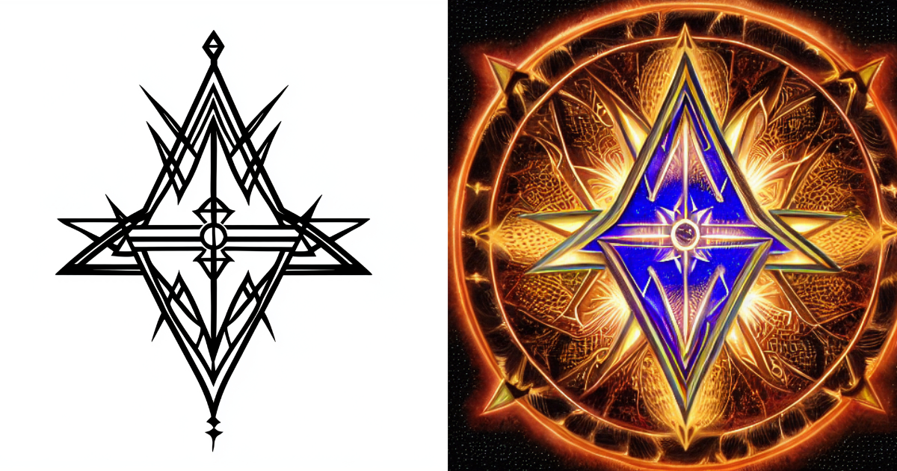

# Sigil Forge

Turn your intention into a powerful sigil at [sigilforge.vectris.dev](https://sigilforge.vectris.dev)



## How it works

This app is powered by:

[Replicate](https://replicate.com/), a platform for running machine learning models in the cloud.

[ControlNet](https://replicate.com/jagilley/controlnet-scribble), an open-source machine learning model that generates images from text and scribbles.

[Cloudinary](https://cloudinary.com/), a cloud-based image management service.

[Vercel](https://vercel.com/), a platform for running web apps.

Next.js [server-side API routes](pages/api), for talking to the Replicate API.

Next.js React components, for the browser UI.

[Tailwind CSS](https://tailwindcss.com/), for styles.

## Development

1. Install a recent version of [Node.js](https://nodejs.org/)

2. Set up your environment variables:
   ```
   REPLICATE_API_TOKEN=<your-token-here>
   CLOUDINARY_CLOUD_NAME=<your-cloud-name>
   CLOUDINARY_API_KEY=<your-api-key>
   CLOUDINARY_API_SECRET=<your-api-secret>
   ```

3. Install dependencies and run the server:
   ```
   npm install
   npm run dev
   ```

4. Open [localhost:3000](http://localhost:3000) in your browser. That's it!

## About

SigilForge is a tool that helps you create and charge magical sigils. Enter your intention, and the app will help you transform it into a unique sigil by removing vowels and repeated letters. Draw your sigil using the remaining letters, and the AI will transform it into a mystical, charged version.